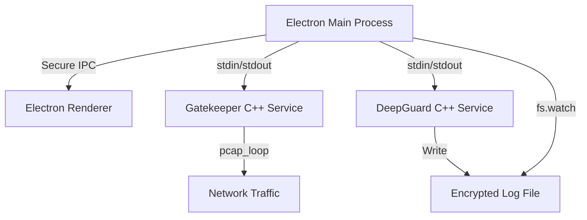

# Specialized Dashboard

> **Ultra High-Performance Electron Dashboard interfacing with Security-Hardened C++ Microservices.**


## 🏗️ Architecture

The application implements a secure, cross-process architecture designed for microsecond-latency request validation and real-time system monitoring.



---

## 🔒 Security Hardening

This project adheres to strict production security standards:

- **Network Capabilities**: Gatekeeper uses raw sockets for packet sniffing. We use Linux Capabilities (`cap_net_raw`) instead of root privileges to minimize the attack surface.
- **Fail-Fast Encryption**: Backend services perform a mandatory check for `GATEKEEPER_KEY` and `MONITOR_KEY`. If keys are missing, the services exit immediately to prevent data leakage.
- **XOR-Encrypted Logging**: All system alerts are encrypted at rest using a symmetric XOR cipher.
- **Electron Security**: `contextIsolation` is enabled, `sandbox` is active, and the `no-sandbox` flag is used only for root-level compatibility with strict capability checks.

---

## 🚀 Performance Benchmarks (at Scale)

Verified on a Linux environment with **150,000 unique users**.

| Component      | Metric         | Value             |
| :------------- | :------------- | :---------------- |
| **Gatekeeper** | **Throughput** | **280,111 req/s** |
| Gatekeeper     | Avg Latency    | **0.0031 ms**     |
| Gatekeeper     | P95 Latency    | 0.0040 ms         |
| **DeepGuard**  | Startup Time   | < 1s              |
| DeepGuard      | Status         | Operational       |

---

## 🛠️ Production Setup & Deployment

Follow these steps to deploy the dashboard in a production environment.

### 1. Prerequisites

- Node.js (v16+)
- `libpcap-dev` (`sudo apt-get install libpcap-dev`)
- `g++` compiler

### 2. Automated Build

Run the production setup script to compile binaries and set necessary network capabilities:

```bash
chmod +x setup_production.sh
./setup_production.sh
```

### 3. Environment Configuration

Create a `.env` file in the `Electron-Dashboard` directory:

```bash
GATEKEEPER_PATH=../API-project/gatekeeper
DEEPGUARD_PATH=../Health-Monitoring-Service/deepguard
MONITOR_KEY=YourSecureMonitorKey
GATEKEEPER_KEY=YourSecureGatekeeperKey
```

### 4. Running as a System Service

A template `dashboard.service` is provided. To install:

1. Update paths in `dashboard.service`.
2. Move to systemd: `sudo cp dashboard.service /etc/systemd/system/`
3. Start: `sudo systemctl enable --now dashboard`

---

## 📡 Live Traffic Demonstration

To test the automatic user tracking:

1. Start the Dashbard and enable **Sniffer Mode** on port 80.
2. Run the simulation script:
   ```bash
   python3 API-project/live_traffic_demo.py 80
   ```
3. Watch the **Live Analytics** feed track unique IPs in real-time.

---

## 📄 License

ISC - High Performance, Secure, and Scalable.
