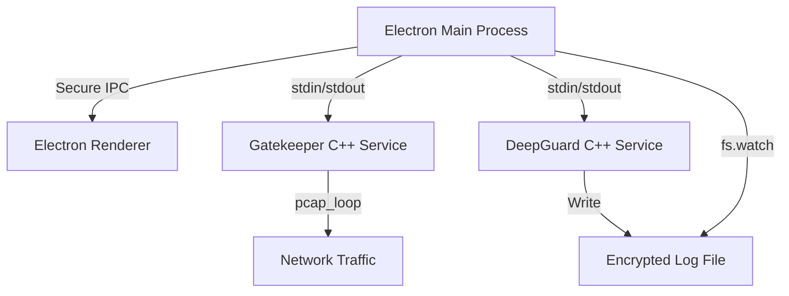

# Specialized Dashboard

> **Ultra High-Performance Electron Dashboard interfacing with Security-Hardened C++ Microservices.**


---

## ⚡ Quick Start: Setup from Scratch

Follow these exact steps to get the entire system running on a clean Linux environment.

### 1. Install System Dependencies (C++ & Networking)

First, ensure your system has the required build tools and the packet capture library:

```bash
sudo apt-get update
sudo apt-get install -y g++ make libpcap-dev nodejs npm python3
```

### 2. Configure Environment Secrets

Create a `.env` file inside the `Electron-Dashboard` directory. This is mandatory for the system to boot securely.

```bash
cd Electron-Dashboard
cat <<EOF > .env
# Backend Binary Paths
GATEKEEPER_PATH=../API-project/gatekeeper
DEEPGUARD_PATH=../Health-Monitoring-Service/deepguard

# Security Keys (Set these to strong, random strings)
MONITOR_KEY=YourSecureMonitorKey_ChangeMe
GATEKEEPER_KEY=YourSecureGatekeeperKey_ChangeMe
EOF
cd ..
```

### 3. Run the Automated Production Setup

This single script will compile the C++ microservices, set granular network permissions (`setcap`), and install the Electron dashboard dependencies.

```bash
chmod +x setup_production.sh
./setup_production.sh
```

### 4. Launch the Dashboard

Finally, start the Electron dashboard. Note: Because we used `setcap` in the previous step, you do **NOT** need to run this as root!

```bash
cd Electron-Dashboard
npm start
```

---

## 🏗️ Architecture

The application implements a secure, cross-process architecture designed for microsecond-latency request validation and real-time system monitoring.



---

## 🔒 Security & Performance

### Hardening

- **Network Capabilities**: Instead of running as `root`, we use `cap_net_raw` for packet sniffing.
- **Fail-Fast Keys**: Backend services refuse to start without valid environment keys.
- **Encrypted Persistence**: All logged metrics and user states are XOR-encrypted at rest.

### Benchmark (150k Users)

| Component      | Metric         | Value             |
| :------------- | :------------- | :---------------- |
| **Gatekeeper** | **Throughput** | **280,111 req/s** |
| Gatekeeper     | Avg Latency    | **0.0031 ms**     |
| Gatekeeper     | P95 Latency    | 0.0040 ms         |

---

## 📡 Testing Features

### Live Traffic Demo

To simulate real-world traffic and see the dashboard track unique IPs in real-time:

1. Start the Dashboard.
2. Click **"Start Sniffer"** on port 80.
3. Run: `python3 API-project/live_traffic_demo.py 80`

### Performance Stress Test

To run the automated benchmark suite yourself:

```bash
cd Electron-Dashboard
python3 benchmark_suite.py --requests 150000 --users 150000
```

---

## 📄 License

ISC - High Performance, Secure, and Scalable.
