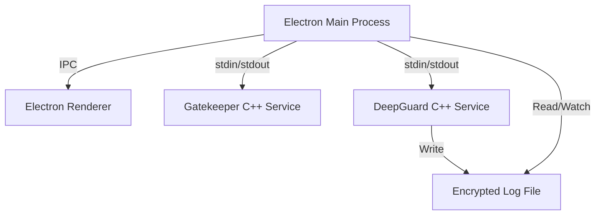

# specialized-dashboard

> **High-Performance Electron Dashboard interfacing with C++ Microservices.**


## Overview

**Specialized Dashboard** is a secure, high-throughput desktop application built with Electron. It serves as a unified control plane for two critical low-level C++ microservices:

1.  **Gatekeeper**: A high-performance, in-memory rate limiting engine.
2.  **DeepGuard**: A system health monitoring service with XOR-encrypted logging.

This project demonstrates the integration of modern web technologies with native system performance, featuring secure IPC communication, real-time data visualization, and robust security hardening.

---

## Architecture

The application follows a secure multi-process architecture:



- **Main Process**: Orchestrates child processes, manages lifecycle, and handles secure decryption of logs.
- **Renderer**: Lightweight UI with Content Security Policy (CSP) enforcement.
- **Gatekeeper**: Handles user request validation with microsecond latency.
- **DeepGuard**: Monitors system resources in the background.

---

## Security Features

This application implements "air-tight" security standards:

- **Content Security Policy (CSP)**: Strict `script-src 'self'` policy to prevent XSS.
- **Input Sanitization**: All IPC commands are validated against a strict allowlist and regex filters before touching native binaries.
- **Secure IPC**: `contextIsolation` enabled; `webviewTag` disabled; permission requests denied by default.
- **Environment Configuration**: Sensitive paths and keys are managed via `.env` (using `dotenv`), separating config from code.

---

## Installation

### Prerequisites

- Node.js (v16+)
- GCC/G++ (for building backend services if needed)
- Python 3 (for benchmarking)

### Setup

1.  **Navigate to the Dashboard Directory**

    ```bash
    cd Electron-Dashboard
    ```

2.  **Install Dependencies**

    ```bash
    npm install
    ```

3.  **Configuration**
    Create a `.env` file in the `Electron-Dashboard` directory:

    ```bash
    cp .env.example .env
    ```

    Edit `.env` to point to your compiled `gatekeeper` and `deepguard` binaries.

4.  **Run Application**
    ```bash
    npm start
    ```

---

## Performance Benchmarks

Benchmarks were conducted on a Linux environment using the included `benchmark_suite.py`.

### Results

| Component      | Metric                      | Value             |
| :------------- | :-------------------------- | :---------------- |
| **Gatekeeper** | **Throughput (150k users)** | **280,111 req/s** |
| Gatekeeper     | Avg Latency                 | 0.0031 ms         |
| Gatekeeper     | P95 Latency                 | 0.0040 ms         |
| **DeepGuard**  | Startup Time                | < 1s              |
| DeepGuard      | Status                      | Operational       |

_Note: Gatekeeper communicates via standard I/O pipes, achieving near-native validation speeds._

---

## Reproducing Benchmarks

To verify these results on your own hardware:

```bash
cd Electron-Dashboard
python3 benchmark_suite.py --requests 10000 --users 150
```

---

---

## Production Deployment

For production environments, follow these steps to ensure security and performance:

### 1. Hardened Security

- **Strict Environment Variables**: Ensure `GATEKEEPER_KEY` and `MONITOR_KEY` are set. The backend will exit if these are missing.
- **Network Capabilities**: Instead of running as `root`, use the provided setup script to grant `cap_net_raw` to the `gatekeeper` binary.

### 2. Deployment Script

Run the automated production setup script:

```bash
chmod +x setup_production.sh
./setup_production.sh
```

### 3. Monitoring Large-Scale Traffic

The system is benchmarked for up to 150,000 concurrent users. For higher loads:

- Increase the `max_requests` configuration during startup.
- Ensure the disk has sufficient space for the `audit_trail.sqlite` database.

---

## License

ISC
